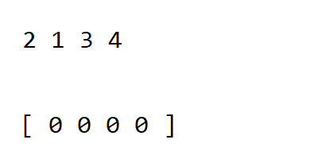

# SORTING ALGORYTHMS (RU)

**Коллекция из 6 сортировок на Python**

 - Сортировка вставками (Insertion Sort)
 - Сортировка слиянием (Merge Sort)
 - Быстрая сортировка (Quick Sort)
 - Сортировка выбором (Selection Sort)
 - Пузырьковая сортировка (Bubble Sort)
 - Сортировка подсчётом (Counting Sort)

[30-минутное видео о сортировках](https://youtu.be/AAwYzYkjNTg?si=TDYWvKjHMImBr2_s)

## Insertion Sort

Этот алгоритм работает путем последовательного вставления
каждого элемента в уже отсортированную часть массива.
Он эффективен для небольших или частично отсортированных массивов.

 - **Как работает**: Проходит по массиву и на каждом шаге вставляет текущий элемент в правильное место среди уже отсортированных элементов.
 - **Преимущества**: Прост в понимании и реализации, эффективен для небольших или почти отсортированных массивов, стабилен (не изменяет порядок одинаковых элементов), онлайн-алгоритм (может сортировать данные по мере их поступления).
 - **Недостатки**: Неэффективен для больших массивов, квадратичная сложность в худшем случае.

 - **Худший случай**: *O(n^2)*. Происходит, когда массив отсортирован в обратном порядке, требуя максимального количества сдвигов и сравнений.
 - **Лучший случай**: *O(n)*. Когда массив уже отсортирован, каждый новый элемент сразу оказывается на своем месте.
 - **Оптимизация**: Использование бинарного поиска для нахождения позиции вставки уменьшит количество сравнений, но не изменит общую сложность *O(n^2)* из-за сдвигов элементов.

## Merge Sort

Это алгоритм "разделяй и властвуй", который разделяет массив на две части, 
рекурсивно сортирует их, а затем сливает в один отсортированный массив.
Он обеспечивает стабильное время выполнения *O(nlogn)* для любых данных.
 - **Как работает**: Разбивает массив на две части, рекурсивно сортирует их, а затем сливает в один отсортированный массив.
 - **Преимущества**: Постоянная асимптотическая сложность *O(nlogn)* во всех случаях, стабилен, хорошо работает для больших массивов.
 - **Недостатки**: Требует дополнительной памяти для хранения подмассивов, неэффективен для небольших массивов.

 - **Худший и лучший случаи**: *O(nlogn)*. Сортировка слиянием всегда работает с этой сложностью, так как она делит массив пополам и сливает их.
 - **Оптимизация**: Для небольших подмассивов (например, менее 10-15 элементов) может быть эффективнее переключиться на сортировку вставками, которая работает быстрее на малых наборах данных.

## Quick Sort

Также использует стратегию "разделяй и властвуй". Алгоритм выбирает опорный элемент и переупорядочивает элементы так,
что все меньшие опорного оказываются перед ним, а все большие — после. Затем рекурсивно применяется к подмассивам.

 - **Как работает**: Выбирает опорный элемент и перегруппировывает элементы вокруг него так, чтобы слева были элементы меньше его, а справа — больше, затем рекурсивно применяет ту же операцию к подмассивам.
 - **Преимущества**: Одна из самых быстрых сортировок на практике, *O(nlogn)* в среднем случае, требует меньше дополнительной памяти по сравнению с сортировкой слиянием.
 - **Недостатки**: Нестабильна, в худшем случае может достигать *O(n^2)*, выбор опорного элемента критичен для эффективности.

 - **Худший случай**: *O(n^2)*. Это случается при неудачном выборе опорного элемента или, например, когда массив уже отсортирован.
 - **Лучший случай**: *O(nlogn)*. Это достигается, когда массив уже отсортирован. Каждый элемент требует только одного сравнения.
 - **Оптимизация**: Использование "медианы трех" для выбора опорного элемента, также для небольших подмассивов можно переключиться на сортировку вставками.

## Selection Sort

В этом алгоритме на каждом шаге ищется минимальный (или максимальный) элемент из неотсортированной части массива 
и обменивается с первым неотсортированным элементом. Он неэффективен для больших списков.

 - **Как работает**: На каждом шаге находит минимальный (или максимальный) элемент в неотсортированной части массива и меняет его местами с первым неотсортированным.
 - **Преимущества**: Прост в реализации, не требует дополнительной памяти.
 - **Недостатки**: Всегда выполняет *O(n^2)* операций, даже если массив уже отсортирован, нестабильна.

 - **Худший и лучший случаи**: *O(n^2)*. Алгоритм всегда проходит через каждый элемент, чтобы найти минимальный и переместить его в начало неотсортированной части.
 - **Оптимизация**: Эффективных оптимизаций для этого алгоритма практически нет, так как его основная идея требует полного обхода массива.

## Bubble Sort

Один из самых простых алгоритмов. Он повторно проходит по списку, сравнивая соседние элементы и меняя их местами,
если они в неправильном порядке. Процесс повторяется, пока не будет достигнута полная сортировка.

 - **Как работает**: Повторно проходит по списку, сравнивая соседние элементы и меняя их местами, если они в неправильном порядке.
 - **Преимущества**: Одна из самых простых сортировок в понимании и реализации.
 - **Недостатки**: Очень неэффективна, особенно для больших массивов, так как всегда имеет *O(n^2)* временную сложность.

 - **Худший случай**: *O(n^2)*. Происходит, когда массив отсортирован в обратном порядке.
 - **Лучший случай**: *O(n)*. Когда массив уже отсортирован, алгоритм делает один проход без обменов.
 - **Оптимизация**: Использование флага для отслеживания, были ли выполнены обмены в течение прохода, и прекращение сортировки, если обменов не было.

## Counting Sort

Этот алгоритм подходит для сортировки целых чисел в определенном диапазоне. Он подсчитывает количество каждого элемента
и использует эту информацию для расположения каждого элемента непосредственно в его конечное место в 
отсортированном массиве. Эффективен для сортировки малых чисел.

 - **Как работает**: Подсчитывает количество каждого уникального элемента, а затем использует эту информацию для размещения элементов непосредственно в их конечные позиции.
 - **Преимущества**: Очень быстрая для небольших диапазонов чисел, имеет временную сложность *O(n + k)*, где *k* - размер диапазона значений.
 - **Недостатки**: Не подходит для сортировки массивов с большими числами или числами с плавающей запятой, требует дополнительной памяти.

 - **Худший и лучший случаи**: *O(n + k)*. где *k* — диапазон чисел. Эффективность зависит от размера диапазона значений.
 - **Оптимизация**: Можно уменьшить k, если возможно, например, когда известно, что диапазон чисел ограничен. Также важно правильно управлять памятью для хранения подсчетов.
